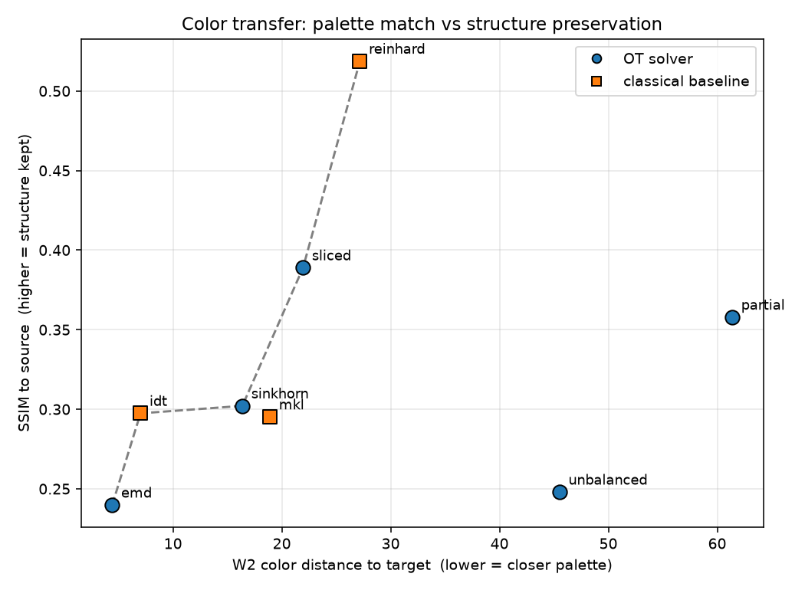
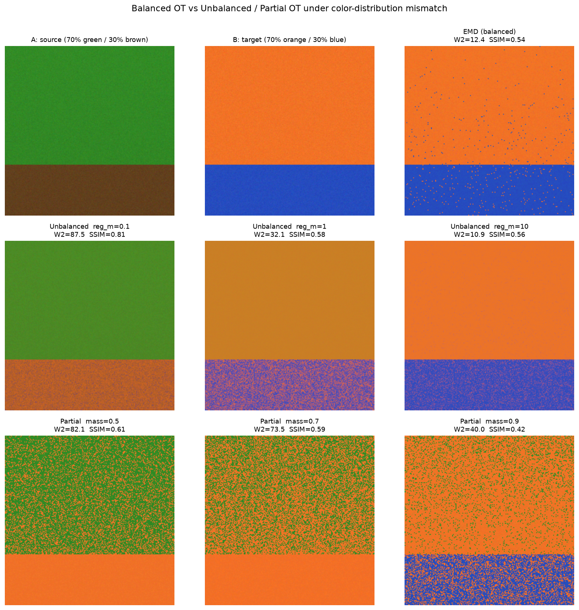

# ot-color-transfer

Benchmark of **Optimal Transport (OT) solvers** against **classical baselines** on
the color-transfer problem, built on [POT (Python Optimal Transport)](https://pythonot.github.io/).

The point of the project: show **where balanced OT breaks** and why. When the
source and target images have a *semantic distribution mismatch* (e.g. source is
mostly green foliage, target is mostly red sunset sky), balanced OT is forced to
satisfy the target color histogram exactly and therefore recolors regions that
should have been left alone. **Unbalanced OT** and **Partial OT** relax that
hard constraint and recover — at the cost of one extra hyperparameter.

---

## Objective

Compare, on identical inputs and metrics:

| family | methods |
|---|---|
| OT solvers (POT) | EMD (exact balanced), Sinkhorn (entropic balanced), Unbalanced OT, Partial OT, Sliced OT |
| classical baselines | Reinhard 2001 (mean/std in Lab), Pitié IDT 2007 (iterative distribution transfer), MKL 2007 (closed-form Gaussian Monge map) |

Every method is reduced to a common pipeline: image → CIELAB → KMeans (K=512)
clusters per image → discrete OT problem `(a, b, C)` → transport plan `P` →
barycentric recoloring → back to RGB. Baselines skip the clustering and work on
raw pixels.

Two evaluation axes (Pareto trade-off):

- **`w2_color_distance`** — Wasserstein-2 between the result's colors and the
  target's colors (Lab). *Lower = palette closer to target.*
- **`ssim_with_source`** — SSIM between the result and the original source.
  *Higher = structure / content preserved.*
- (plus `color_histogram_intersection` as a secondary palette-overlap check.)

---

## Code structure

```
src/
  color_pipeline.py   RGB -> Lab -> KMeans -> OTProblem(a, b, C, Xs, Xt, labels, shapes).
                      Also make_synthetic_pair() for test images.
  solvers.py          solve_ot(a, b, C, method, **kw) -> plan P, for method in
                      {emd, sinkhorn, unbalanced, partial, sliced}. Thin wrapper
                      over ot.emd / ot.sinkhorn / ot.unbalanced.sinkhorn_unbalanced /
                      ot.partial.partial_wasserstein; "sliced" builds an
                      approximate coupling by averaging exact 1-D OT plans
                      (ot.emd_1d) over random projections.
  barycentric.py      map_colors(P, Xt, source_labels, Xs, ...) -> recolored RGB
                      image via barycentric mapping. keep_unmatched=True blends
                      untransported mass back to the source color (for partial /
                      unbalanced).
  baselines.py        reinhard_transfer / iterative_distribution_transfer /
                      mkl_transfer, all in Lab, returning RGB in [0, 1].
  metrics.py          w2_color_distance / ssim_with_source /
                      color_histogram_intersection / compute_all_metrics.

experiments/
  run_benchmark.py    Runs all 5 solvers + 3 baselines on one image pair, writes
                      results/transfer_*.png, prints the metric table, saves
                      results/pareto_plot.png and results/montage.png.
  mismatch_demo.py    The core experiment: a deliberately mismatched synthetic
                      pair, EMD vs Unbalanced (reg_m in {0.1, 1, 10}) vs Partial
                      (mass in {0.5, 0.7, 0.9}); saves the titled grid
                      results/mismatch_comparison.png + a small metric table.

data/                 input images (small synthetic PNGs committed; drop your own
                      source.png / target.png here to have run_benchmark pick them up).
results/              generated figures.
```

Every module in `src/` has a `__main__` block that runs a small self-contained
demo (`python src/<module>.py`).

---

## How to run

```bash
python -m venv venv && source venv/bin/activate      # optional
pip install -r requirements.txt

# full benchmark (synthetic pair by default)
python experiments/run_benchmark.py
python experiments/run_benchmark.py path/to/source.png path/to/target.png --k 512

# core experiment: balanced OT failure under distribution mismatch
python experiments/mismatch_demo.py
python experiments/mismatch_demo.py path/to/A.png path/to/B.png
```

Requires Python 3.10+ and the packages in `requirements.txt`
(`pot`, `numpy`, `scipy`, `scikit-image`, `scikit-learn`, `matplotlib`, `opencv-python`).

---

## Key findings

### 1. Balanced OT satisfies the palette but destroys structure

On the default synthetic pair (green source, red-sunset target, K=512):

| method | type | W2 to target ↓ | SSIM to source ↑ | hist-inter ↑ |
|---|---|---|---|---|
| **emd** | OT (balanced) | **4.41** | **0.240** | 0.815 |
| sinkhorn | OT (balanced) | 16.37 | 0.302 | 0.254 |
| unbalanced | OT | 45.51 | 0.248 | 0.132 |
| partial | OT | 61.38 | 0.358 | 0.570 |
| sliced | OT | 21.95 | 0.389 | 0.208 |
| reinhard | baseline | 27.17 | 0.519 | 0.033 |
| idt | baseline | 7.02 | 0.297 | 0.927 |
| mkl | baseline | 18.91 | 0.295 | 0.115 |

`emd` gets the best palette match (W2 ≈ 4) but the worst structure score
(SSIM ≈ 0.24, barely above the target image itself) — it forces *every* green
pixel onto a red one because the exact marginal constraint leaves it no choice.



### 2. Unbalanced / Partial OT recover under semantic mismatch

`mismatch_demo.py`: source A = 70% green / 30% brown, target B = 70% orange /
30% blue. Green has **no color neighbour** in B.

| config | W2 to target ↓ | SSIM to source ↑ |
|---|---|---|
| source (identity) | 92.37 | 1.000 |
| EMD (balanced) | 12.43 | 0.538 |
| Unbalanced `reg_m=0.1` | 87.45 | **0.815** |
| Unbalanced `reg_m=1` | 32.13 | 0.583 |
| Unbalanced `reg_m=10` | 10.86 | 0.556 |
| Partial `mass=0.5` | 82.10 | 0.609 |
| Partial `mass=0.7` | 73.54 | 0.585 |
| Partial `mass=0.9` | 39.98 | 0.422 |



- **EMD** recolors the green canopy fully to orange and the brown soil fully to
  blue — the hard marginal constraint forces implausible green→blue matches.
- **Unbalanced OT** with small `reg_m` leaves the green canopy untouched
  (SSIM 0.81) and only shifts the part that has a plausible target.
- **Partial OT** with `mass=0.5` transports only the cheapest half of the mass
  and keeps the rest.
- As `reg_m → large` or `mass → 1`, both converge back to balanced OT.

### 3. Interpretation

Balanced OT enforces **hard marginal constraints**: all mass `a_i` must leave
source cluster `i` and all mass `b_j` must arrive at target cluster `j`. When the
two color distributions don't overlap semantically, the only feasible plans are
bad ones.

- **Unbalanced OT** replaces the hard constraint with a soft penalty
  `reg_m · KL(marginal ‖ a)`. Small `reg_m` → cheap to drop/keep mass → source
  preserved; large `reg_m` → back to balanced. `reg_m` is in the same units as
  the cost matrix (the demo normalizes the cost to `[0, 1]` so `reg_m` in
  `{0.1, 1, 10}` spans the useful range).
- **Partial OT** directly caps the transported mass fraction `m ∈ (0, 1]`; the
  solver keeps the most expensive `1 − m` of the mass in place. `m = 1` is exactly
  balanced OT.

The trade-off is an extra hyperparameter (`reg_m` or `m`) that has to be tuned
per image pair — there is no single value that is right for every mismatch level.
```
